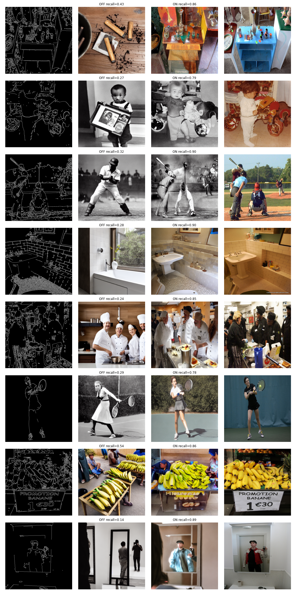
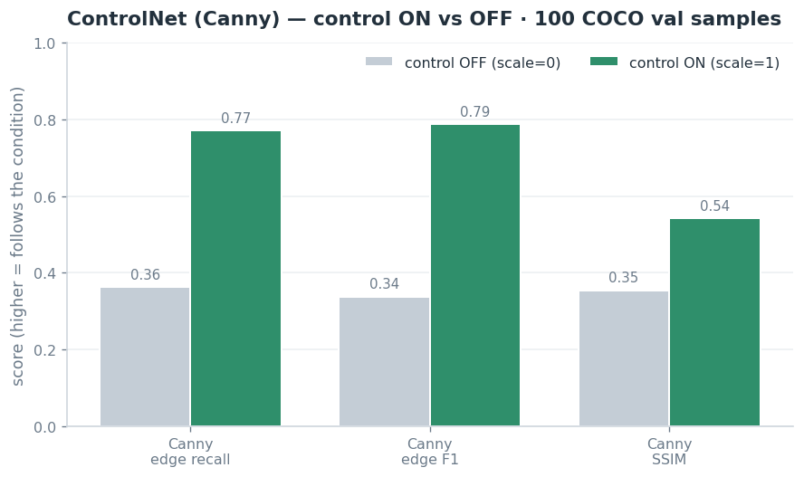
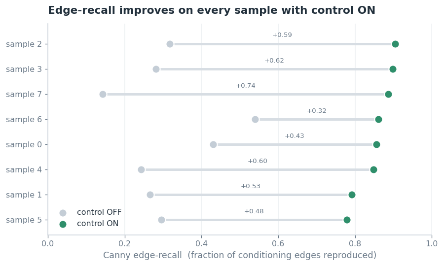
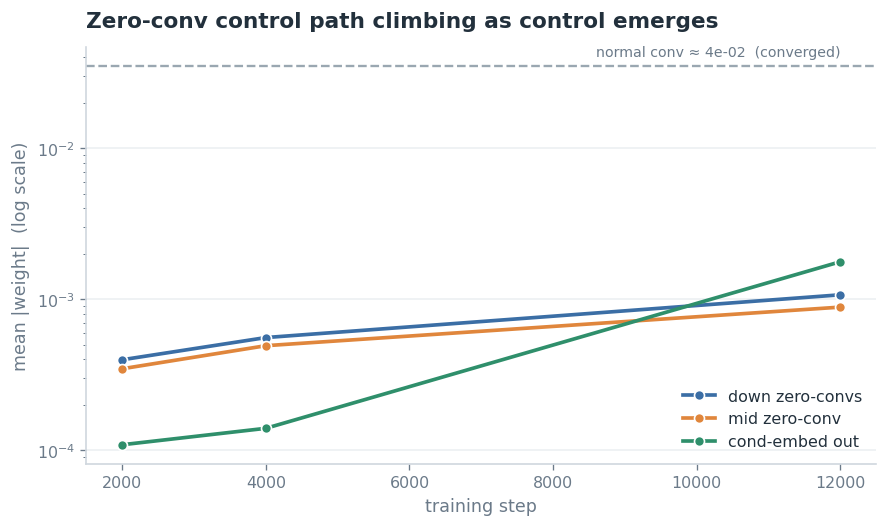

# ControlNet from Scratch — Parity-Verified


A **from-scratch, parity-verified** PyTorch implementation of ControlNet — *"Adding Conditional
Control to Text-to-Image Diffusion Models"* ([Zhang, Rao & Agrawala, 2023](https://arxiv.org/abs/2302.05543)) —
on a frozen Stable Diffusion v1.5.

The ControlNet here is **hand-written**, not a wrapper around the library model. Its correctness
isn't just claimed — it's **proven by a test** (`tests/test_parity_with_diffusers.py`) that asserts
its residuals match Hugging Face `diffusers.ControlNetModel` to **~1e-4** given identical weights.
It was then trained on COCO (Canny edges) — **45k images, 12k steps** on a single mid-range GPU — and
evaluated against a control-off baseline.



*Columns: **Canny edges** (the condition) · **control OFF** (`scale=0`, ignores the edges) ·
**control ON** (`scale=1`, follows them) · **original**. Each pair generated from the same seed;
COCO val2017 at 512px. Trained 12k steps on a 45k-image COCO train2017 subset.*

A full end-to-end narrative — data → conditioning → architecture → training → results — renders on
GitHub in [`notebooks/walkthrough.ipynb`](notebooks/walkthrough.ipynb).

## How it works

ControlNet adds spatial control (Canny edges, depth, pose, …) to a frozen diffusion model:

1. **Freeze** the pretrained SD U-Net.
2. **Clone** its encoder + middle block into a trainable copy.
3. A small **conditioning network** maps the pixel-space condition into the latent grid and is
   added to the trainable copy's input.
4. The copy's per-layer outputs pass through **zero convolutions** (1×1 convs initialised to zero,
   so training starts as an exact no-op) and are injected into the frozen U-Net's decoder as
   `down_block_additional_residuals` / `mid_block_additional_residual`.
5. Train with the standard DDPM noise-prediction loss and 50% prompt dropout — only the
   ControlNet learns.

The hand-written wiring lives in `src/models/controlnet.py`; it reuses Stable Diffusion's own block
primitives (that's the base model, not ControlNet's contribution), which is exactly what makes the
1e-4 parity check possible.

## Results

Trained ControlNet (Canny) vs. the **same model with control switched off**
(`controlnet_conditioning_scale=0`), **100 COCO val2017 samples**, identical seeds:

| Metric | Control **ON** | Control **OFF** (baseline) |
|---|:--:|:--:|
| Canny edge-recall ↑ (edges reproduced) | **0.77** | 0.36 |
| Canny edge-F1 ↑ | **0.79** | 0.34 |
| Canny SSIM ↑ (structural adherence) | **0.54** | 0.35 |
| CLIP score ↑ (text alignment) | 31.6 | 31.8 |



Turning control on roughly **doubles edge fidelity** (recall 0.36 → 0.77, F1 0.34 → 0.79) and lifts
structural SSIM (0.35 → 0.54), while **CLIP score is unchanged** (~31.6) — the model follows the Canny
edges at no cost to prompt adherence. _FID is omitted from the headline: at 100 samples it is far too
noisy to be meaningful (it needs thousands); for the record it was 173 (ON) vs 199 (OFF), i.e. control
did not hurt realism._

And this isn't an average hiding failures — **edge-recall rises on every individual sample** when
control is switched on:



## Quick start

```bash
pip install -e .[dev,train,eval]

# 1. Prepare data (COCO val2017 + captions; add --download on a fresh machine)
python scripts/prepare_coco.py --root data/coco --download

# 2. Prove correctness for free (CPU, seconds)
pytest tests/

# 3. Smoke-test training locally (e.g. a 4 GB laptop GPU)
accelerate launch scripts/train.py --config configs/smoke_local.yaml
```

## Training

Only the ControlNet trains — the SD U-Net, VAE, and text encoder stay frozen (loss is the standard
DDPM noise-prediction MSE with 50% prompt dropout). Training is driven by `accelerate` and a YAML
config.

**Local smoke test** — validates the whole pipeline on a small GPU (e.g. 4 GB):
```bash
accelerate launch scripts/train.py --config configs/smoke_local.yaml
```

**Full training** — on a larger GPU (24–32 GB):
```bash
accelerate launch scripts/train.py --config configs/full.yaml
```

Tune the run in `configs/*.yaml`: `image_size`, `train_batch_size`, `gradient_accumulation_steps`,
`max_train_steps`, and `data.max_train_samples`. Checkpoints are written to `outputs/<run>/` as
`controlnet-<step>.safetensors` every `checkpointing_steps`. The results above were trained with
`configs/full.yaml` (512², 12k steps, effective batch 16, bf16) on a **45k-image COCO `train2017`
subset** and evaluated on `val2017`.

**Watching control emerge.** ControlNet's loss stays flat and noisy, so it's a poor progress signal.
The real tell is the **zero convolutions** lifting off their zero init toward a normal conv's
scale — that's spatial control being learned. `scripts/diagnose.py` tracks it per checkpoint:



(Still climbing at 12k — the model is functional but not yet saturated, so there is headroom from a
longer run.)

## Evaluation

```bash
python scripts/evaluate.py --controlnet outputs/full/controlnet-final.safetensors --config configs/full.yaml --num-samples 100
# control-off baseline for comparison:
python scripts/evaluate.py --controlnet outputs/full/controlnet-final.safetensors --config configs/full.yaml \
    --num-samples 100 --conditioning-scale 0.0 --output outputs/eval_baseline.json
```
Reports **Canny edge-recall / edge-F1 / SSIM** (the ControlNet-specific "did it follow the control?"
metrics) and **CLIP score**. Regenerate the comparison chart above from the two JSON reports with
`python scripts/plot_metrics.py`.

## Repository layout

```
configs/      YAML configs (local smoke / 24-32GB / A100)
data/         datasets (gitignored) — built by scripts/prepare_coco.py
docs/         image_requirements.md
scripts/      prepare_coco.py · train.py · evaluate.py · diagnose.py · plot_metrics.py · plot_training.py
src/
  models/     zero_conv.py · conditioning.py · controlnet.py   (the hand-written model)
  data/       dataset.py (COCO captions + on-the-fly Canny) · preprocess.py
  training/   trainer.py (accelerate-based)
  inference/  generate.py
  evaluation/ metrics.py (Canny fidelity · CLIP · FID)
tests/        test_parity_with_diffusers.py (headline) · test_smoke_train.py · test_zero_conv.py
notebooks/    walkthrough.ipynb (end-to-end, renders on GitHub)
```

## Conditioning types

| Type | Input | Status |
|------|-------|--------|
| `canny` | grayscale edge map | **implemented & trained** |
| `depth`, `pose`, `seg`, `normal`, `scribble` | see `docs/image_requirements.md` | extensible via `controlnet-aux` |

## Citation

```bibtex
@inproceedings{zhang2023controlnet,
  title={Adding Conditional Control to Text-to-Image Diffusion Models},
  author={Zhang, Lvmin and Rao, Anyi and Agrawala, Maneesh},
  booktitle={ICCV},
  year={2023}
}
```

## License

MIT — see [LICENSE](LICENSE). Builds on Hugging Face Diffusers and Stable Diffusion (Stability AI).